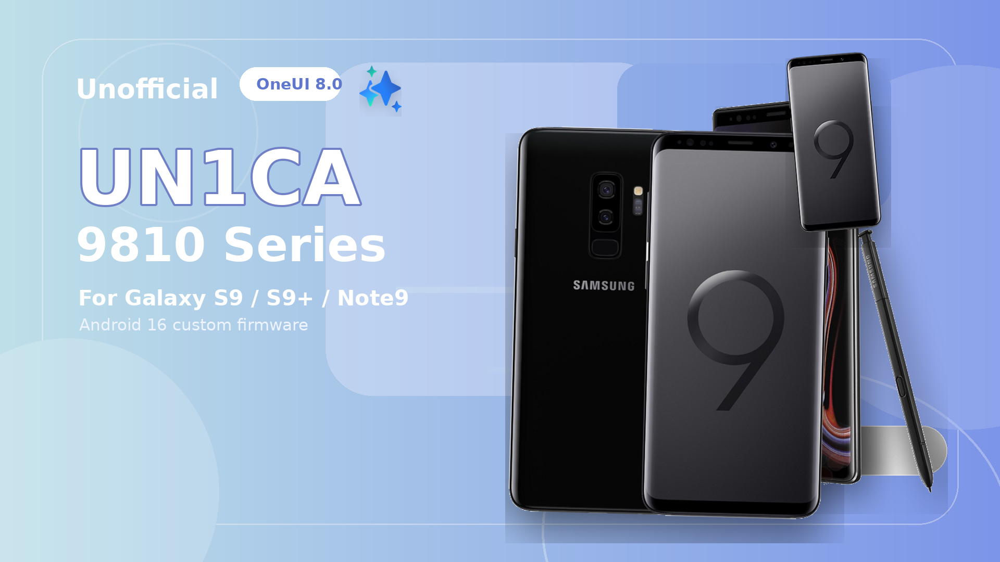

# Unofficial UN1CA 9810

<p align="center">
  
</p>

Unofficial UN1CA 9810 is an experimental custom firmware project for Samsung Exynos9810 devices, maintained by Eend15 and based on the UN1CA build system by salvo_giangri.

It is designed to bring a modern, refined, and feature-rich One UI experience to the Galaxy S9, Galaxy S9+, and Galaxy Note9. The current development target is Android 16 / One UI 8.0, adapted for the legacy Exynos9810 platform.

This is an unofficial community port. It is not affiliated with Samsung and is not an official release from the upstream UN1CA maintainers.

## What Is UN1CA 9810?

UN1CA 9810 keeps the upstream UN1CA workflow: the build system extracts Samsung firmware, applies ROM patches, prepares target-specific files, and generates a flashable recovery zip.

This fork changes the target from newer supported Samsung devices to Exynos9810 devices. It adds a dedicated platform layer, S9/S9+/Note9 targets, repartition support, recovery compatibility hooks, kernel installer support, and device-specific fixes required to boot One UI 8 on these phones.

The goal is to provide a usable Android 16 / One UI 8 ROM for the Exynos Galaxy S9 series and Note9 while keeping as much of the upstream UN1CA experience as possible.

## Supported Devices

- Galaxy S9 Exynos (`starlte`, SM-G960F
- Galaxy S9+ Exynos (`star2lte`, SM-G965F
- Galaxy Note9 Exynos (`crownlte`, SM-N960F

## Current Base

- Android 16 / One UI 8.0 target
- Galaxy S22 source firmware path, following the upstream UN1CA layout
- Exynos9810 vendor compatibility work based around Note10 Lite VNDK33 components
- S9, S9+, and Note9 stock firmware extraction support
- Exynos9810 recovery, partition, and kernel workflow integration

## Core Features

- One UI 8 experience adapted for Exynos9810
- Retained upstream UN1CA feature patches where compatible
- Galaxy AI framework support where hardware and vendor components allow it
- Galaxy S25 wallpapers and sounds from upstream UN1CA
- High-end animations, native blur, live blur, and One UI Home animation options
- AOD clock transition support
- Adaptive color tone, outdoor mode, extra brightness, and camera privacy toggle support
- Picture remaster, object eraser, shadow eraser, reflection eraser, and image clipper support where compatible
- Multi-user support
- Samsung DeX framework support where hardware allows it
- Dual Messenger available for all apps
- Custom FlipFont font support
- Extra CSC features such as call recording, Hiya, network speed in the status bar, and AltZLife where compatible
- BluetoothLibraryPatcher and KnoxPatch integration from upstream UN1CA
- UN1CA Settings with custom Bixby Button remapper! Play Integrity / PIF tooling, TrickyStore options, Hide My Applist integration, developer-options hiding, app downgrade toggle, old target SDK install toggle, secure screenshot toggle, screenshot and screen-recording detection toggle, Google Photos backup option, and games FPS unlock toggle

## Exynos9810 Port Features

- Dedicated `exynos9810` platform layer for legacy non-dynamic partition devices
- Device targets for `starlte`, `star2lte`, and `crownlte`
- Automatic Exynos9810 repartition and clean install flow integrated into the installer
- DS-ACK and CrownTrail-compatible kernel installer support
- Permissive and enforcing kernel package support
- KernelSU-Next support through compatible kernel packages
- Custom TWRP lite and large ZIP compatibility hooks for older recovery environments
- EROFS-aware and large ZIP recovery workflow support when paired with a compatible recovery
- Exynos9810 boot, fstab, first-stage init, metadata, keymaster, radio, and slot/IMEI compatibility fixes
- Note10 Lite vendor vndk33 adaptation with S9/S9+/Note9 specific overlays and properties
- Bluetooth compatibility patches for the legacy Exynos9810 stack
- Audio HAL compatibility patches and legacy audio effect backports
- Camera feature matrices split per device, including S9 single-camera and S9+/Note9 dual-camera layouts
- One UI 8 camera compatibility fixes for photo, video, portrait, and pro-mode paths where possible
- Debloat profile tailored for legacy Exynos9810 memory and partition limits
- Device-specific overlays, DVFS/SIOP policy hooks, floating features, CSC feature tuning, and framework feature declarations

## Build

Use the same build entry point as upstream UN1CA:

```bash
source buildenv.sh star2lte unica make_rom -z
source buildenv.sh starlte unica make_rom -z
source buildenv.sh crownlte unica make_rom -z
```

Build output and extracted firmware are intentionally not tracked in git. Keep `out/` and `work/` local.

## Installation

1. Flash the custom TWRP recovery first:
   https://drive.google.com/drive/folders/1_vXPLfoYasOAByOShmqu7nljq2kHvTus

2. Boot into the custom TWRP recovery.

3. Get the UN1CA zip onto the device using one of:
   - Copy it to your microSD card and select it from there in TWRP, or
   - Drag/copy the zip onto internal storage, or
   - Use a USB stick (OTG) plugged into the device

4. In TWRP, tap Install, select the UN1CA zip, and swipe to flash.

5. Once flashing completes, go back and tap Wipe > Format Data,
   then type "yes" to confirm.
   (This is required, not optional — a Format Data wipe is needed
   for a clean install and to resolve encryption on first boot.)

6. Reboot System.

First boot after a Format Data wipe can take a few minutes longer
than usual — this is normal.

Notes:
- Back up EFS, modem, and any important data before you start —
  this ROM is still a porting project.
- Only flash on supported Exynos9810 models: S9 (`starlte`),
  S9+ (`star2lte`), Note9 (`crownlte`).

### Accountability

```
#include <std_disclaimer.h>

/*
* Your warranty is now void.
*
* I am not responsible for bricked devices, dead SD cards,
* thermonuclear war, or you getting fired because the alarm app failed. Please
* do some research if you have any concerns about doing this to your device
* YOU are choosing to make these modifications, and if
* you point the finger at me for messing up your device, I will laugh at you.
*
```

## Branches

- `Android-16`: active Android 16 / One UI 8 Exynos9810 work
- `Qpr2`: reserved branch for future Android 16 QPR2 work (if even possible)

## Status

This ROM is still a porting project. Some hardware features may require device-specific debugging, logs, vendor changes, kernel changes, or recovery-side fixes.

Flash only on supported Exynos models. Keep backups of EFS, modem, and important data before testing.

## Credits

- [salvogiangri](https://github.com/salvogiangri) and all upstream UN1CA contributors for the original project and build system
- Exynos9810 kernel and device-port contributors in the Galaxy S9, Galaxy S9+, and Galaxy Note9 community
- BluetoothLibraryPatcher, KnoxPatch, TrickyStore, Play Integrity Fix, and the other upstream projects used by UN1CA

## License

This project follows the upstream UN1CA license terms. See [LICENSE](LICENSE).
This project is licensed under the terms of the GNU General Public License v3.0. External dependencies might be distributed under a different license, such as:

android-tools, licensed under the Apache License 2.0
apktool, licensed under the Apache License 2.0
erofs-utils, dual license (GPL-2.0, Apache-2.0)
img2sdat, licensed under the MIT License
platform_build (ext4_utils, f2fs_utils, signapk), licensed under the Apache License 2.0
